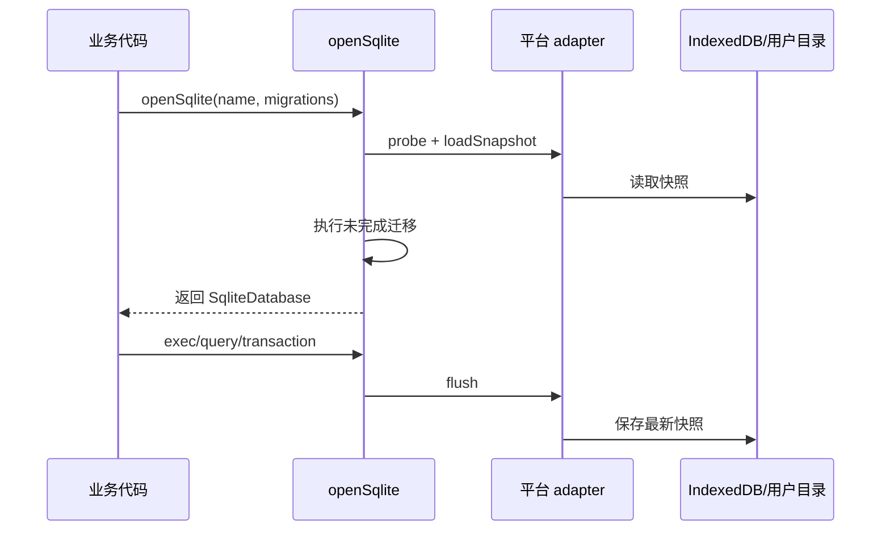

如果你只想使用 SQLite，可以先阅读[快速开始](./getting-started)；本页解释“为什么这样设计”，帮助你排查能力错误和选择高级 adapter。

## 从打开到保存



## 七层边界

### weapp-vite 集成

`@weapp-sqlite/weapp-vite` 是应用默认入口。插件读取当前单目标构建信息，生成目标专用 runtime 并只发射对应 WASM；`openSqlite()` 负责能力探测、连接合并、自动迁移和统一错误。业务源码不引用平台全局、WASM 路径或底层 storage。

### core

`@weapp-sqlite/core` 不知道 SQLite 引擎来自哪里，也不依赖任何平台 API。它提供 `SqliteDatabase`、`SqliteConnection`、`SqliteTransaction` 和 `migrate`，并负责串行化操作、事务提交回滚和关闭状态检查。

### WASM adapter

`@weapp-sqlite/wasm` 将一个符合 `SqlJsInitializer` 的初始化器包装成 `SqliteDriver`。它负责：

- 将数组参数、命名参数和 `boolean`、`bigint`、`ArrayBuffer` 转成 sql.js 可接受的值。
- 将 sql.js 的列数组和值数组还原成带列名的行对象。
- 在连接变脏后调用 `storage.save` 保存 `database.export()`。

### sql.js 引擎资源

`@weapp-sqlite/sqljs/full` 包装 `sql.js@1.14.2`；`@weapp-sqlite/sqljs/lite` 固定 SQLite 3.49.1 与 Emscripten 5.0.0，并提交生成资源、许可证、来源和哈希。普通项目构建不需要 Emscripten。构建期插件只通过 `@weapp-sqlite/sqljs/node` 解析资源，不把 Node API带入宿主中立的 WASM adapter。

微信分包模式把 engine-neutral adapter 留在主包。首次 `probe()` 前，主包 loader 通过静态 `require.async()` 下载并缓存分包 initializer；initializer chunk 与 WASM 都属于同一普通分包，避免 `sharedStrategy: 'hoist'` 将引擎提升回主包。

### Web 宿主 adapter

`@weapp-sqlite/web` 使用 IndexedDB 持久化二进制数据库，提供 `load`、`save` 和 `remove`。IndexedDB 不可用时会抛出稳定的 `SqliteWebStorageUnavailableError`，不会退回内存数据库。

### 小程序宿主 adapter

`@weapp-sqlite/miniprogram` 定义统一的平台、runtime、能力探测、数据库文件和包内资源读取协议。应用显式传入 `platform` 和顶层 runtime，包本身不依赖 weapp-vite 的 AST API 重写。

`@weapp-sqlite/debug` 位于生成工作台与数据库宿主之间，只通过 `SqliteDatabase` 和 `load/save/remove` 管理快照；它不进入 core，也不直接访问 IndexedDB、微信文件系统或 sql.js 实例。CSV/JSON codec、写 SQL、撤销和文件交付只存在于调试构建。

微信使用 `getFileSystemManager()` 和 `env.USER_DATA_PATH` 持久化数据库，并通过 `WXWebAssembly` 按代码包路径实例化。其他目标可构建并进入相同能力探测边界；文件系统、WASM 或文件交付能力未满足时返回结构化 `unsupported`，不会静默切换到内存。

`MiniProgramHostAdapter` 的 `instantiatePackageWasm` 是宿主 WebAssembly 边界。微信实现验证 sql.js 所需的构造器和 BigInt TypedArray，并为部分 DevTools 未暴露的 `RuntimeError` 提供等价 `Error` 构造器；它只在标准 `WebAssembly` 缺失时安装兼容命名空间，已有不同实现时明确失败，不覆盖全局对象。

### 自定义宿主存储

宿主只需要实现两个异步方法：

```ts
interface SqliteWasmStorage {
  load: (name: string) => Promise<Uint8Array | undefined>
  save: (name: string, data: Uint8Array) => Promise<void>
}
```

调试控制器使用扩展的 `SqliteDebugStorage`，额外要求 `remove(name)`，用于真实删除数据库快照。导入仍通过同一组 `load/save/remove` 边界替换文件，不让控制器感知 IndexedDB 或微信用户目录。

自定义引擎可以实现 `SqliteRuntimeAdapter` 并通过 `openSqlite({ adapter })` 注入；底层宿主也可继续实现 `MiniProgramHostAdapter`。平台行为留在集成和宿主包，`@weapp-sqlite/core` 与 `@weapp-sqlite/wasm` 始终不导入 Web 或小程序 API。

## 操作与事务

同一个数据库的 `exec`、`query`、`transaction` 和 `close` 会经过内部队列串行执行。事务回调成功时提交，回调抛错时回滚；嵌套事务会抛出 `SqliteTransactionError`。关闭后继续调用数据库方法会抛出 `SqliteClosedError`。

## 数据持久化时机

每次写操作完成后，core 会调用 connection 的可选 `flush`。WASM adapter 的 `flush` 只在有脏数据时导出数据库，因此读操作不会产生额外保存。应用退出或切后台前仍建议主动 `close()`，让最后一批数据及时落盘。
