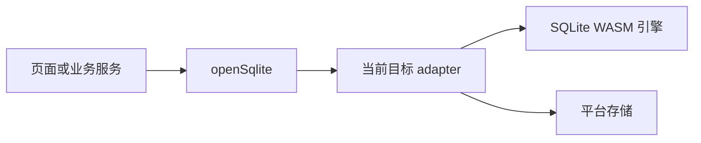

如果你第一次在小程序里使用 SQLite，可以先记住一句话：业务代码只负责“打开数据库并执行 SQL”，平台差异由 adapter 处理。

## 一次调用发生了什么



- `openSqlite()` 返回统一的 `SqliteDatabase`。
- adapter 负责加载引擎、读取快照和保存快照。
- Web 把快照保存到 IndexedDB；微信把快照保存到用户目录文件。
- `@weapp-sqlite/core` 不知道浏览器、微信或 WASM 的存在，因此可以独立测试。

## 为什么 API 都是异步的

打开数据库可能要读取持久化文件和初始化 WASM，保存数据库也可能要访问宿主文件系统。统一使用 Promise 可以让 Web 和小程序使用相同的业务代码：

```ts
const db = await openSqlite({ name: 'app.sqlite', migrations })
const rows = await db.query<{ id: number, title: string }>(
  'SELECT id, title FROM notes WHERE archived = ?',
  [0],
)
```

不要在模块顶层假设数据库已经打开；把打开动作放在应用初始化或页面生命周期中，并处理失败状态。

## 迁移是数据库的版本控制

迁移描述“数据库应该怎样从旧版本变成新版本”。每个版本只能执行一次，已执行版本保存在 `__weapp_sqlite_migrations` 中：

```ts
const migrations = [
  {
    version: 1,
    name: 'create_notes',
    up: transaction => transaction.exec(
      'CREATE TABLE notes (id INTEGER PRIMARY KEY, title TEXT NOT NULL)',
    ),
  },
  {
    version: 2,
    name: 'add_archived',
    up: transaction => transaction.exec(
      'ALTER TABLE notes ADD COLUMN archived INTEGER NOT NULL DEFAULT 0',
    ),
  },
] as const
```

迁移版本必须是正整数且唯一。不要在应用代码里反复执行 `CREATE TABLE` 或手动修改迁移表。

## 事务保证一组操作一起成功

事务中的所有操作要么全部提交，要么全部回滚：

```ts
await db.transaction(async transaction => {
  await transaction.exec('INSERT INTO notes (title) VALUES (?)', ['第一条'])
  await transaction.exec('INSERT INTO notes (title) VALUES (?)', ['第二条'])
})
```

回调抛出错误时会自动回滚。不要把需要一起成功的数据写入拆成多个没有事务保护的调用。

## 始终使用参数绑定

用户输入必须作为参数传入，不能拼接到 SQL 字符串中：

```ts
// 正确
await db.query('SELECT * FROM notes WHERE title = ?', [title])

// 错误：不要把 title 拼接进 SQL
// await db.query(`SELECT * FROM notes WHERE title = '${title}'`)
```

参数绑定同时解决 SQL 注入和引号、空值、特殊字符处理问题。

## flush、close 和持久化

- 写入后，WASM adapter 会在 flush 阶段导出最新二进制快照。
- `await db.flush()` 用于在调试导出或建立快照前等待保存完成。
- `await db.close()` 会先 flush，再关闭连接，并从同名连接注册表移除。
- 关闭后再次 `openSqlite()` 会从持久化存储重新加载。

同一个数据库名称的并发 `openSqlite()` 会合并为一次初始化并返回共享实例。如果同名打开使用了不同 adapter 或不同迁移配置，会返回 `SQLITE_OPEN_OPTIONS_CONFLICT`。

## 一份业务代码，多个构建产物

业务代码可以在 Web、微信、支付宝、抖音、百度、京东和小红书保持一致，但每个目标仍需单独构建。构建插件只注入当前目标的 runtime 和 WASM 资源，因此不会把其他平台 API 打进产物。

“可以构建”不等于“已经支持”。正式支持还需要对应平台的 DevTools、iOS 和 Android 证据；能力不足时会返回结构化 `unsupported`，不会静默切换到内存数据库。
