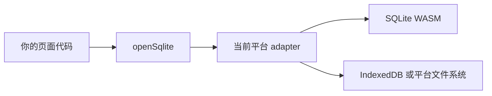

`weapp-sqlite` 让你在 Web 和小程序中使用同一套 SQLite 业务代码。你只需要调用 `openSqlite()`，平台差异由构建插件和 adapter 处理。

## 包结构

- `@weapp-sqlite/core`：异步连接、查询、事务、迁移和错误类型。
- `@weapp-sqlite/wasm`：将 `sql.js` 这类 SQLite WASM 引擎接入 core，并通过回调持久化数据库文件。
- `@weapp-sqlite/web`：使用 IndexedDB 持久化 Web 二进制数据库。
- `@weapp-sqlite/miniprogram`：通用小程序宿主协议，首期内置微信文件系统 driver。
- `@weapp-sqlite/debug`：开发期数据工作台，预览和管理本地数据库。
- `@weapp-sqlite/weapp-vite`：推荐的统一构建插件和运行时入口。

平台可构建不等于运行已支持。当前支付宝、抖音、百度、京东和小红书目标只验证构建与稳定 `unsupported` 契约；微信结论还需要真实开发者工具及 iOS/Android 真机证据。

## 推荐阅读路径

1. [快速开始](./getting-started)：从空项目跑通第一次查询。
2. [核心概念](./concepts)：理解迁移、事务、flush 和多端存储。
3. [调试工作台](./debug-workbench)：预览表、编辑数据和导入导出文件。
4. [架构与生命周期](./architecture)：了解连接、事务和存储的职责边界。
5. [多端接入](./multi-platform)：选择构建目标并处理平台差异。
6. [支持矩阵与验收](./acceptance)：了解哪些证据才能称为“已支持”。
7. [API 参考](./api/core)：查阅稳定类型和错误码。

## 适合与不适合

适合本地数据、离线缓存、草稿、表单和需要事务一致性的端内功能。不适合把 SQLite 当作远程共享数据库、线上运营后台或跨设备同步服务；这些场景需要服务端数据库和明确的同步策略。

## 运行时边界

WASM 文件和数据库文件都属于应用资源，不由 `@weapp-sqlite/core` 自动下载或保存。调用方需要提供 `locateFile` 和 `storage`，并在目标平台验证文件访问权限、包体积限制及持久化策略。
